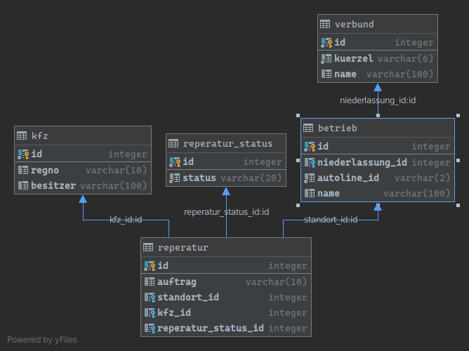

# Rapid Prototyping NestJS und Angular

## Was ist Rapid Prototyping?

## Technologie-Entscheidung

Wir möchten Code zwischen Backend, Frontend und Bibliotheken teilen können.
Eine gemeinsame Sprache in allen Teilprojekten zu verwenden bietet sich an.
Auch soll die Einstiegshürde für neue Team-Mitglieder möglichst niedrig sein.
Als Sprache bietet sich Typescript an, da es
a) Entwicklern die bisher nur Javascript Erfahrung haben erlaubt sich leicht einzuarbeiten.
b) Entwicklern die bisher OOP mit z.B.: Java entwickelt haben ein solides Typsystem bereitstellt.

Für das Frontend setzen wir auf Angular. Andere Frameworks wären genauso möglich.
Angular bietet ein sehr gutes Gesamtpaket.

Das Backend wird mit dem Framework NestJS entwickelt, das viele Konzepte analog
zu Angular implementiert.

Zur Anbindung an bestehende Postgres SQL Datenbanken nutzen wir TypeORM.
Diese Bibliothek ist ungefähr das, was JDBC im Java Umfeld ist. Es kann zu
verschiedenen Datenbank-Systemen eine Verbindung herstellen. Zusätzlich gibt
es Unterstützung für die Versionierung und automatisierte Datenbankschema-Migration.

## Das Tool Nx

### Was ist NX?

Nx ist eine Erweiterung und Aufsatz auf das Angular Command Line Interface.
Es stellt einen Workspace bereit und bietet Werkzeuge um zum Beispiel Code zu generieren,
das Build-System zu bedienen, oder aber auch Tests zu starten.

Zusätzlich bietet Nx Werkzeuge, um Abhängigkeiten innerhalb des Projekts zu steuern
und eine Möglichkeit die Verwendungen von mittels Constraints einzuschränken.

### Was ist ein Monorepo?

Anstatt jedes Projekt in ein eigenes Repository zu legen, werden mehrere Teilprojekte in
demselben Repository abgelegt. Dieses Vorgehen hat mehrere Vorteile:

- Einfachere Wiederverwendung von Quellcode, da keine Versionen als Artefakt veröffentlicht werden müssen.
- Bessere Verwaltung von Abhängigkeiten auf Fremd-Bibliotheken da diese für alle Teilprojekte gleich sind
- Atomare Commits, bei denen Änderungen über alle Teilprojekte hinweg durchgeführt werden
- Teamübergreifende Zusammenarbeit über Projektgrenzen hinweg

Es existieren aber auch Nachteile:

- Sichtbarkeit kann nicht pro Teilprojekt gesteuert werden. Zugriff aufs Repository bedeutet Lese- bzw. Schreibrechte 
  auf dem gesamten Quellcode.
- Nicht alle Build-Systeme unterstützen Monorepos und werden langsamer als separat gebaute Projekte.

### Monorepo mit NX

Für das Prototyping existieren mindestens zwei Projekte, das Backend und das Frontend. Zusätzlich
möchten wir Code für beide Teilprojekte wiederverwenden können. Mit einem NX Workspace können wir
genau das tun.

## Umgebung mit NX einrichten

```bash
npx create-nx-workspace@latest
```

Vergebe den Workspace Namen `tmp` und den Application Namen `workshop-prototype`. Wähle das Preset
`Angular-Nest` aus und die Style Extension Sass.

Sobald die Generierung abgeschlossen ist, verschiebe den Inhalt des Verzeichnisses `tmp` in die Project-Root.

Ergänze die `prototype/package.json` den Eintrag `scripts` um ein Script zum Starten des Backends.

```json
{
  "scripts": {
    "start": "ng serve prototype",
    "start:api": "ng serve api"
  }
}
```

## Bibliothek für geteilten Code zwischen Backend und Frontend einrichten

Um Code zwischen Backend und Frontend teilen zu können, schreiben wir geteilten Code
in ein oder mehrere Bibliothek-Projekte. Zu diesem Zweck bietet sich die Verwendung
des `@nrwl/workspace` Schematic an.

```bash
ng g @nrwl/workspace:lib shared
```

## Abgrenzungen von Abhängigkeiten

Um zu vermeiden, das jedes Teilprojekt beliebig Code aus anderen Teilen importieren kann,
können wir Constraints setzen. Jedes Projekt kann in der `nx.json` Datei Tags besitzen. In 
der `ts-lint.json` können diese genutzt werden, um den Import auf bestimmte Tags zu beschränken.

Füge in der nx.json zu jedem Teilprojekt ein Tag ein. Für das Frontend verwende den Tag
`scope:frontend`, für das API Projekt `scope:backend` und für die beiden Bibliotheken `scope:lib`.

Erweitere in der `ts-lint.json` die Einschränkung der Imports so, dass Projekte mit dem Tag `scope:lib`
nur aus Projekten mit dem Tag `scope:lib` importieren dürfen. Frontend-Projekte dürfen aus
anderen Frontend-Projekten importieren und aus Bibliotheken. Analog dazu dürfen Backend Projekte andere
Backend Projekte und Bibliotheken verwenden.


## Datengetriebene Entwicklung

In vielen Fällen wird die Umsetzung einer Idee von schon vorhandenen Daten getrieben. In unserem
Beispiel verwenden wir eine bestehende Postgres Datenbank um unseren Prototyp und unsere
UseCases zu beschreiben.

Im Ordner `docker/db` befindet sich die Datei `create_db.sql` in der sich die DDL und einige
Beispiel-Daten finden. Sofern Docker installiert ist, kann im Verzeichnis `docker` einfach
mittels docker-compose ein Container mit Datenbank gestartet werden.

```bash
docker-compose up -d
```

Sollte kein Docker verwendet werden können, muss eine Datenbank entweder im Netzwerk oder einer
lokalen Installation erzeugt werden.



## Entwicklung Backend

### Installieren TypeORM und typeorm-model-generator

Aus einer bestehenden Datenbank möchten wir uns die Klassen des ORM-Mappings generieren lassen.
Dazu nutzen wir im nächsten Schritt den `typeorm-model-generator`. Wir installieren mit dem folgenden 
Befehl TypeORM, die Abhängigkeiten und den Treiber für die Verbindung. 

```bash
npm install typeorm @nestjs/typeorm typeorm-model-generator pg
```

In `apps/api/src/AppModule` muss im Decorator unter `imports` TypeOrmModule eingefügt werden.
Sollte nicht die Datenbank über die `docker-compose.yml` verwendet werden, müssen eventuell 
die Zugangsdaten angepasst werden.

```typescript
@Module({
  imports: [TypeOrmModule.forRoot({
    name: "default",
    type: "postgres",
    host: "localhost",
    port: 1433,
    username: "postgres",
    password: "s4fePassword",
    database: "postgres",
    synchronize: false,
    entities: []
  })],
  controllers: [AppController],
  providers: [AppService]
})
export class AppModule {}
```


### Generierung der Entity

Um nun die Entities direkt aus der Datenbank erzeugen zu lassen, nutzen wir den 
`typeorm-model-generator`. Sollte nicht die `docker-compose.yml`
verwendet werden, müssen eventuell die Zugangsdaten angepasst werden.

```bash
npx typeorm-model-generator -h localhost -d "postgres" -u sa -x s4fePassword -e postgres -o ./apps/api/src
```

Der Weg wie die Entities generiert werden führt dazu, dass wir in der Datei `apps/api/tsconfig.json`
das Modul-system auf CommonJS umstellen müssen. 

In `apps/api/src/app/app.module.ts` müssen die generierten Entity Klassen in das Array der `entries`
eingetragen werden.

### Definition Schnittstelle zwischen Backend und Frontend

Es ist sinnvoll die Entities nicht 1 : 1 vom Backend zum Frontend zu senden. Um diese Trennung besser umsetzbar
zu machen wird im `api-interfaces` Projekt ein Vertrag in Form von Interfaces geschlossen.

```typescript
export interface IStandort {
  id: number;
  autolineId: string;
  name: string;
}

export interface INiederlassung {
  id: number;
  gssn: string
  name: string | null;
  standorte: IStandort[]
}

export interface IKfz {
  id: number;
  regno: string | null;
  besitzer: string | null;
}

export type IReperaturStatus = 'Termin' | 'Annahme' | 'Service' | 'Werkstatt' | 'Wäsche' | 'Abholung' | 'Abgeschlossen';

export interface IReperatur {
  id: number;
  auftrag: string | null;
  standort: IStandort,
  kfz: IKfz,
  reperaturStatus: IReperaturStatus
}
```

### API Endpunkte für Stammdaten

Die Datenbank Zugriffe sollen in einem eigenen Service gekapselt sein. Mittels Angular CLI lässt sich ein neuer NestJS
Service generieren. Im Datenbankservice kann per Injection die Connection injiziert werden.

```bash
ng generate @nestjs/schematics:service db --sourceRoot=apps/api/src/app --flat=true
```

In `apps/api/src/app/app.controller.ts` werden neue REST Endpunkte für GET Requests der Stammdaten eingefügt.

```typescript
@Get('niederlassung')
  async getNiederlassungen(): Promise<Niederlassung[]> {
    return this.dbService.loadAllNiederlassungen();
  }
```

### API Endpunkt für Reparaturen

Bisher werden die per Relation verbundenen Tabellen nicht mit geladen. Es wäre möglich die Daten zu holen und programmatisch
wieder zusammenzusetzen. Dies ist jedoch nicht nötig. Es kann direkt in der Methode `Repository#find` in den Optionen angegeben
werden, welche der Relationen geladen werden sollen. 

```typescript
this.connection.getRepository(Reperatur)
      .find({ relations: ['reperaturStatus', 'standort', 'kfz'] });
```

### Anpassen der Datenbank mittels Migration

Muss im Zuge der Entwicklung die Datenbankstruktur angepasst werden, sollte die Migration nicht manuell durch das Ausführen von SQL 
Befehlen geschehen, sondern automatisch durch die Anwendung durchgeführt werden. Hierfür bietet sich TypeOrm Migrationsskripte an.

Erzeuge eine neue Datei `ormconfig.json` im root des Projects und kopiere den folgenden Inhalt.
```json
{
  "name": "default",
  "username": "postgres",
  "password": "s4fePassword",
  "database": "postgres",
  "schema": "public",
  "synchronize": false,
  "type": "mssql",
  "host": "localhost",
  "port": 1433,
  "entities": ["apps/api/src/entities/*.js"],
  "migrationsTableName": "custom_migration_table",
  "migrations": ["apps/api/dist/migration/*.ts"],
  "cli": {
    "migrationsDir": "apps/api/src/migration"
  }
}
```

Füge folgendes script in die `package.json` hinzu um Migrationen erzeugen zu können
```json
{
  "scripts": {
   "typeorm": "ts-node -r tsconfig-paths/register ./node_modules/typeorm/cli.js"
  }
}
```

Erzeuge eine neue Migration mit der wir der Tabelle `kfz` eine Spalte `farbe` hinzufügen wollen.
 
```bash
typeorm migration:create -n AddKfzColorColumn
```

es wird eine Datei im Ordner `src/apps/api/src/migrations` erzeugt. Der Name beginnt mit einem Zeitstempel. 
Öffne die Datei und schreibe ein SQL Statement innerhalb der `run` Methode, das die Spalte hinzufügt.

```typescript
     public async up(queryRunner: QueryRunner): Promise<any> {
         await queryRunner.query(`ALTER TABLE ...`);
     }
```

Füge der OrmConfig in `apps/api/src/app/app.module.ts` folgende Einträge hinzu:

```typescript
    migrations: [
      AddKfzColorColumn123456789 // Die Zufallszahl am Ende muss deiner Datei entsprechen
    ],
    migrationsRun: true,
```

Starte nun die Api mithilfe des Befehls `npm run start:api`.
Beobachte wie der Tabelle ein neues Column hinzugefügt wurde.

Füge der Entity `Kfz.ts` die neue Property hinzu
```typescript
  @Column("varchar", { name: "farbe", nullable: true, length: 50 })
  farbe: string | null;
```

erweitere ebenfalls das Interface `IKfz` um die neue property
