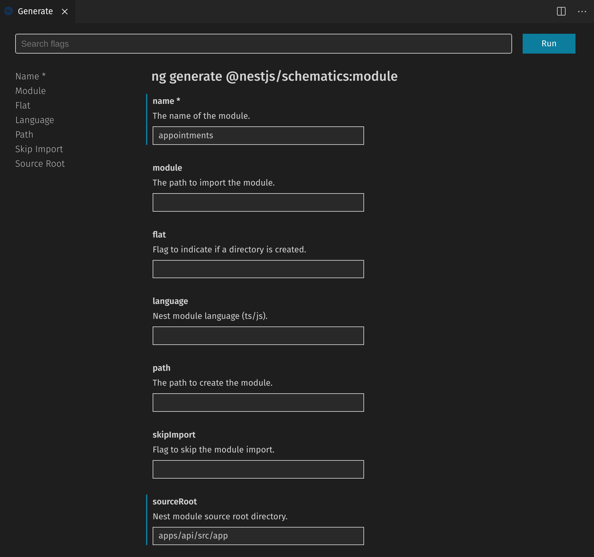

# Rapid Prototyping NestJS und Angular

## Was ist Rapid Prototyping?

## Technologie-Entscheidung

Wir möchten Code zwischen Backend, Frontend und Bibliotheken teilen können.
Eine gemeinsame Sprache in allen Teilprojekten zu verwenden bietet sich an.
Auch soll die Einstiegshürde für neue Team-Mitglieder möglichst niedrig sein.
Als Sprache bietet sich Typescript an, da es
a) Entwicklern die bisher nur Javascript Erfahrung haben erlaubt sich leicht einzuarbeiten.
b) Entwicklern die bisher OOP mit z.B.: Java entwickelt haben ein solides Typsystem bereitstellt.

Für das Frontend setzen wir auf Angular. Andere Frameworks wären genauso möglich.
Angular bietet ein sehr gutes Gesamtpaket.

Das Backend wird mit dem Framework NestJS entwickelt, das viele Konzepte analog
zu Angular implementiert.

Zur Anbindung an bestehende Postgres SQL Datenbanken nutzen wir TypeORM.
Diese Bibliothek ist ungefähr das, was JDBC im Java Umfeld ist. Es kann zu
verschiedenen Datenbank-Systemen eine Verbindung herstellen. Zusätzlich gibt
es Unterstützung für die Versionierung und automatisierte Datenbankschema-Migration.

## Das Tool Nx

### Was ist NX?

Nx ist eine Erweiterung und Aufsatz auf das Angular Command Line Interface.
Es stellt einen Workspace bereit und bietet Werkzeuge um zum Beispiel Code zu generieren,
das Build-System zu bedienen, oder aber auch Tests zu starten.

Zusätzlich bietet Nx Werkzeuge, um Abhängigkeiten innerhalb des Projekts zu steuern
und eine Möglichkeit die Verwendungen von mittels Constraints einzuschränken.

### Was ist ein Monorepo?

Anstatt jedes Projekt in ein eigenes Repository zu legen, werden mehrere Teilprojekte in
demselben Repository abgelegt. Dieses Vorgehen hat mehrere Vorteile:

- Einfachere Wiederverwendung von Quellcode, da keine Versionen als Artefakt veröffentlicht werden müssen.
- Bessere Verwaltung von Abhängigkeiten auf Fremd-Bibliotheken da diese für alle Teilprojekte gleich sind
- Atomare Commits, bei denen Änderungen über alle Teilprojekte hinweg durchgeführt werden
- Teamübergreifende Zusammenarbeit über Projektgrenzen hinweg

Es existieren aber auch Nachteile:

- Sichtbarkeit kann nicht pro Teilprojekt gesteuert werden. Zugriff aufs Repository bedeutet Lese- bzw. Schreibrechte 
  auf dem gesamten Quellcode.
- Nicht alle Build-Systeme unterstützen Monorepos und werden langsamer als separat gebaute Projekte.

### Monorepo mit NX

Für das Prototyping existieren mindestens zwei Projekte, das Backend und das Frontend. Zusätzlich
möchten wir Code für beide Teilprojekte wiederverwenden können. Mit einem NX Workspace können wir
genau das tun.

## Umgebung mit NX einrichten

```bash
npx create-nx-workspace@latest
```

Vergebe den Workspace Namen `tmp` und den Application Namen `workshop-prototype`. Wähle das Preset
`Angular-Nest` aus und die Style Extension Sass.

Sobald die Generierung abgeschlossen ist, verschiebe den Inhalt des Verzeichnisses `tmp` in die Project-Root.

Ergänze die `package.json` den Eintrag `scripts` um ein Script zum Starten des Backends.

```json
{
  "scripts": {
    "start:api": "ng serve api"
  }
}
```

## Bibliothek für geteilten Code zwischen Backend und Frontend einrichten

Um Code zwischen Backend und Frontend teilen zu können, schreiben wir geteilten Code
in ein oder mehrere Bibliothek-Projekte. Zu diesem Zweck bietet sich die Verwendung
des `@nrwl/workspace` Schematic an.

```bash
ng g @nrwl/workspace:lib shared
```

## Abgrenzungen von Abhängigkeiten

Um zu vermeiden, das jedes Teilprojekt beliebig Code aus anderen Teilen importieren kann,
können wir Constraints setzen. Jedes Projekt kann in der `nx.json` Datei Tags besitzen. In 
der `ts-lint.json` können diese genutzt werden, um den Import auf bestimmte Tags zu beschränken.

Füge in der nx.json zu jedem Teilprojekt ein Tag ein. Für das Frontend verwende den Tag
`scope:frontend`, für das API Projekt `scope:backend` und für die beiden Bibliotheken `scope:lib`.

Erweitere in der `ts-lint.json` die Einschränkung der Imports so, dass Projekte mit dem Tag `scope:lib`
nur aus Projekten mit dem Tag `scope:lib` importieren dürfen. Frontend-Projekte dürfen aus
anderen Frontend-Projekten importieren und aus Bibliotheken. Analog dazu dürfen Backend Projekte andere
Backend Projekte und Bibliotheken verwenden.


## Datengetriebene Entwicklung

In vielen Fällen wird die Umsetzung einer Idee von schon vorhandenen Daten getrieben. Im Moment verwenden
wir der Einfachheit halber Mock-Daten. Später werden wir sehen wie wir Daten aus einer bestehenden Datenbank
benutzen können.

### Termine im Backend

Wir beginnen damit das Backend um eine Route für Reparatur-Termine zu erweitern. Die Struktur beschreiben
wir als Typescript Interface im Bibliothek-Projekt und Mock-Daten in Form einfacher Typescript Dateien 
im Server. 

```typescript
/** libs/api-interfaces/src/lib/api-interfaces.ts */
export interface Appointment {
  id?: number;
  assignment: string;
  branch: string;
  vehicleOwner: string;
  vehicleRegNo: string;
  status: string;
  date: string;
  time: string;
}
```

Wir erzeugen wir in unserem API Projekt einen Service und einen Controller mit jeweils dem Namen Appointments
Dies kann über die Kommandozeile oder aber über die Visual Studio Code Extension `Nx Console` erfolgen. 
*Achtung* bei den Schematics zu NestJS muss der Pfad in dem generiert werden soll explizit mit angegeben werden.



Die Nutzung der `Nx Console` erzeugt im Terminalfenster von Visual Studio Code den zur
Generierung genutzten Befehl. Im folgenden werden nur noch die Kommandozeilen-Befehle
aufgeführt.

```bash
ng generate @nestjs/schematics:service --name=appointments --sourceRoot=apps/api/src/app --no-interactive
ng generate @nestjs/schematics:controller --name=appointments --sourceRoot=apps/api/src/app --no-interactive
```

Die Termine beziehen wir aus einer Mock-Datei die parallel zum Service liegt.   

```typescript
/** apps/api/src/app/appointments/appointments.mock.ts */
export const APPOINTMENTS: Appointment[] = [
  {
    id: 1,
    assignment: '000-000-01',
    branch: 'Dortmund',
    status: 'Reperatur',
    date: '2020-09-02',
    time: "07:00",
    vehicleOwner: "Sascha",
    vehicleRegNo: "ES-WW-01"
  },
  {
    id: 2,
    assignment: '000-000-02',
    branch: 'Berlin',
    status: 'Abholung',
    date: '2020-09-03',
    time: "08:00",
    vehicleOwner: "Tobi",
    vehicleRegNo: "B-WW-33"
  }
];
```

Die Termine werden im Service synchron zur Verfügung gestellt. Dieser kann dann per 
Dependency Injection im Controller konsumiert werden.

```typescript
/** apps/api/src/app/appointments/appointments.service.ts */
@Injectable()
export class AppointmentsService {
  private appointments: Appointment[] = APPOINTMENTS;

  getAll(): Appointment[] {
    return this.appointments;
  }
}

/** apps/api/src/app/appointments/appointments.controller.ts */
@Controller('appointments')
export class AppointmentsController {

  constructor(private readonly appointmentService: AppointmentsService) {  }

  @Get()
  getAllApointments(): Appointment[] {
    return this.appointmentService.getAll();
  }
}
```

Nachdem mit `npm run start:api` das Backend gestartet wurde, kann im Browser mit der URL
`localhost:3333/api/appointments` getestet werden, ob sich die Termine abrufen lassen.


### Termine im Frontend anzeigen

Für die nächste Stufe möchten wir die Termine im Browser anzeigen. Dazu werden diese per Http-Client
vom Server abgerufen. Der Abruf wird nicht von der anzuzeigenden Komponente selbst durchgeführt,
sondern in einem Service gekapselt. Die Termine werden in Form einer Liste ausgegeben.

```bash
ng generate @schematics/angular:module --name=appointments --routing --no-interactive
ng generate @schematics/angular:service --name=appointments/appointments --no-interactive
ng generate @schematics/angular:component --name=appointments/appointmentListRoute --no-interactive
ng generate @schematics/angular:component --name=appointments/appointmentList --no-interactive
```

In der Komponente `AppointmentListRouteComponent` werden die Termine per Service geladen und
in `AppointmentListComponent` per Input hereingereicht und angezeigt.


### Termine im Frontend bearbeiten

Der nächste Schritt ist eine Detailansicht zu den einzelnen Terminen mit den allen Informationen.
In dieser sollen auch ein Formular zur Bearbeitung enthalten sein. Wir erweitern die Termine um eine
numerische ID um das Routing abbilden zu können. Das Speichern soll einen HTTP-Request auslösen. 

Es wird eine neue Route für die Detailansicht angelegt und die Komponenten generiert.

```bash
ng generate @schematics/angular:component --name=appointments/appointmentDetailRoute --no-interactive
ng generate @schematics/angular:component --name=appointments/appointmentDetail --no-interactive
``` 

Die `AppointmentDetailRouteComponent` liest die Id des Termins aus den Routen-Parametern aus und
verwendet den Service um die `AppointmentDetailsComponent` anzuzeigen. Das Button zum Speichern
soll im Moment nur eine Ausgabe in der Konsole machen.

### Speichern der Termine im Server

Wir erweitern den Controller der Termine um eine Methode zum Bearbeiten. Diese annotieren wir mit
Patch. Der Service wird um eine Methode zum Aktualisieren eines Termins erweitert.

```typescript
/** apps/api/src/app/appointments/appointments.service.ts */
export class AppointmentsService {
  updateAppointment(id: number, appointment: Partial<Appointment>) {
    const canidate: Appointment | undefined = this.appointments.find(a => a.id === id)
    if (canidate === undefined) {
      throw new Error(`no appointment with id ${id} found.`);
    }
    const patchedAppointment: Appointment = { ...canidate, ...appointment };
    this.appointments = this.appointments.map(a => a.id === id ? patchedAppointment : a);
    return patchedAppointment;
  }
}

/** apps/api/src/app/appointments/appointments.controller.ts */
@Controller('appointments')
export class AppointmentsController {
  @Patch(':id')
  saveAppointment(@Param('id') id: string, @Body() appointment: Partial<Appointment>): Appointment {
    console.log("id %o, appointment %o", id, appointment);
    return this.appointmentService.updateAppointment(parseInt(id, 10), appointment);
  }
}
```

Im Frontend wird das Formular an die neue Backend Route zum Speichern angepasst. Der `AppointmentsService`
im Client wird ebenso erweitert.

```typescript
/** apps/workshop-prototype/src/app/appointments/appointments.service.ts */
export class AppointmentsService {
  saveAppointment(id: number, appointment: Partial<Appointment>): Observable<Appointment> {
    return this.http.patch<Appointment>('api/appointments/' + id, appointment)
      .pipe(
        tap(result => this.subject.next(this.subject.value.map(a => a.id === id ? result : a))),
        switchMap(() => this.getById(id).pipe(take(1)))
      );
  }
}
```


### Öffnungszeiten für die einzelnen Reparatur-Standorte

Nicht jeder unserer Standorte hat zu genau den gleichen Zeiten geöffnet. Wir erweitern unser Datenmodell
um Öffnungszeiten. Das Abschicken des Formulars soll nur möglich sein, wenn die Filiale auch in der
Zeit geöffnet hat.

Um Entscheidungen zu den Öffnungszeiten fällen zu können, legen wir diese für die einzelnen Standorte 
fest. Zur Überprüfung im Formular verwenden wir einen asynchronen Validator an der Gruppe. 

```typescript
/** apps/workshop-prototype/src/app/appointments/opening-hours-validator.service.ts */
export const timeRegExp = /^(0[0-9]|1[0-9]|2[0-3]):[0-5][0-9]$/;

@Injectable({
  providedIn: 'root',
})
export class OpeningHoursValidatorService {
  constructor(private readonly appointmentsService: AppointmentsService) {}

  openingHoursValidator(timeControlName: string, branchIdControlName: string): AsyncValidatorFn {
    return (group: FormGroup) => {
      const time = group.get(timeControlName)?.value;
      const branchId = group.get(branchIdControlName)?.value;
      return this.appointmentsService.getOpeningHoursPerBranch().pipe(
        first(),
        map((perBranch) => perBranch[branchId]),
        map((openingHoursOfBranch) => {
          if (time == null || openingHoursOfBranch == null) {
            return { openingHours: 'Could not find time or opening hours' };
          }

          return isTimeInInterval(time, openingHoursOfBranch.openingHoursStart, openingHoursOfBranch.openingHoursEnd)
            ? null
            : {openingHours: `time ${time} is not in interval [${openingHoursOfBranch.openingHoursStart}, ${openingHoursOfBranch.openingHoursEnd}]`, };
        })
      );
    };
  }
}

function isTimeInInterval(time: string, start: string, end: string): boolean {
  const allInCorrectFormat =
    timeRegExp.test(time) && timeRegExp.test(start) && timeRegExp.test(end);
  if (allInCorrectFormat === false) {
    return false;
  }

  return allInCorrectFormat && time >= start && time <= end;
}
```

### Öffnungszeiten im Frontend und Backend prüfen

Nur das Absenden des Formulars zu blockieren ist nicht genug. Auch in unserem Server möchten wir
verhindern, dass Termine angelegt werden, bei denen die Filiale nicht geöffnet ist. Die notwendige
Prüfung verschieben wir aus dem Frontend in das Bibliothek-Projekt und verwenden den gleichen Code
sowohl im Browser als auch in unserem Nest-Server.


## Testen

Bisher haben wir noch keine Tests geschrieben. Das wollen wir ändern. 


## Persistenz mittels TypeORM

Es gibt mehr als eine Möglichkeit unsere Daten über den Neustart des Backends hinweg zu erhalten.
Eine davon ist die Anbindung unseres Backends an eine SQL-Datenbank. Bisher haben wir die Daten
zusammen mit unserem Prototyp entwickelt. Oft liegen diese aber schon vor. 

Das letzte Thema beschäftigt sich mit der Anbindung einer Datenbank an unseren Server. Zusätzlich
beleuchten wir, wie vorhandene Datensätze für unser Prototyping nutzbar gemacht werden kann.

.. !-------------------------------------------------------------------------------------------------------------

## Datengetriebene Entwicklung

In vielen Fällen wird die Umsetzung einer Idee von schon vorhandenen Daten getrieben. In unserem
Beispiel verwenden wir eine bestehende Postgres Datenbank um unseren Prototyp und unsere
UseCases zu beschreiben.

Im Ordner `docker/db` befindet sich die Datei `create_db.sql` in der sich die DDL und einige
Beispiel-Daten finden. Sofern Docker installiert ist, kann im Verzeichnis `docker` einfach
mittels docker-compose ein Container mit Datenbank gestartet werden.

```bash
docker-compose up -d
```

Sollte kein Docker verwendet werden können, muss eine Datenbank entweder im Netzwerk oder einer
lokalen Installation erzeugt werden.


## Entwicklung Backend

### Installieren TypeORM und typeorm-model-generator

Aus einer bestehenden Datenbank möchten wir uns die Klassen des ORM-Mappings generieren lassen.
Dazu nutzen wir im nächsten Schritt den `typeorm-model-generator`. Wir installieren mit dem folgenden 
Befehl TypeORM, die Abhängigkeiten und den Treiber für die Verbindung. 

```bash
npm install typeorm @nestjs/typeorm typeorm-model-generator pg
```

In `apps/api/src/AppModule` muss im Decorator unter `imports` TypeOrmModule eingefügt werden.
Sollte nicht die Datenbank über die `docker-compose.yml` verwendet werden, müssen eventuell 
die Zugangsdaten angepasst werden.

```typescript
@Module({
  imports: [TypeOrmModule.forRoot({
      name: "default",
      type: "postgres",
      host: "localhost",
      port: 5432,
      username: "postgres",
      password: "s4fePassword",
      database: "postgres",
      schema: "public",
      synchronize: false,
      entities: []
    })],
  controllers: [AppController],
  providers: [AppService]
})
export class AppModule {}
```


### Generierung der Entity

Um nun die Entities direkt aus der Datenbank erzeugen zu lassen, nutzen wir den 
`typeorm-model-generator`. Sollte nicht die `docker-compose.yml`
verwendet werden, müssen eventuell die Zugangsdaten angepasst werden.

```bash
npx typeorm-model-generator -h localhost -d "postgres" -u sa -x s4fePassword -e postgres -o ./apps/api/src
```

Der Weg wie die Entities generiert werden führt dazu, dass wir in der Datei `apps/api/tsconfig.json`
das Modul-system auf CommonJS umstellen müssen. 

In `apps/api/src/app/app.module.ts` müssen die generierten Entity Klassen in das Array der `entries`
eingetragen werden.

### Definition Schnittstelle zwischen Backend und Frontend

Es ist sinnvoll die Entities nicht 1 : 1 vom Backend zum Frontend zu senden. Um diese Trennung besser umsetzbar
zu machen wird im `api-interfaces` Projekt ein Vertrag in Form von Interfaces geschlossen.

```typescript
export interface IStandort {
  id: number;
  autolineId: string;
  name: string;
}

export interface INiederlassung {
  id: number;
  gssn: string
  name: string | null;
  standorte: IStandort[]
}

export interface IKfz {
  id: number;
  regno: string | null;
  besitzer: string | null;
}

export type IReperaturStatus = 'Termin' | 'Annahme' | 'Service' | 'Werkstatt' | 'Wäsche' | 'Abholung' | 'Abgeschlossen';

export interface IReperatur {
  id: number;
  auftrag: string | null;
  standort: IStandort,
  kfz: IKfz,
  reperaturStatus: IReperaturStatus
}
```

### API Endpunkte für Stammdaten

Die Datenbank Zugriffe sollen in einem eigenen Service gekapselt sein. Mittels Angular CLI lässt sich ein neuer NestJS
Service generieren. Im Datenbankservice kann per Injection die Connection injiziert werden.

```bash
ng generate @nestjs/schematics:service db --sourceRoot=apps/api/src/app --flat=true
```

In `apps/api/src/app/app.controller.ts` werden neue REST Endpunkte für GET Requests der Stammdaten eingefügt.

```typescript
@Get('niederlassung')
  async getNiederlassungen(): Promise<Niederlassung[]> {
    return this.dbService.loadAllNiederlassungen();
  }
```

### API Endpunkt für Reparaturen

Bisher werden die per Relation verbundenen Tabellen nicht mit geladen. Es wäre möglich die Daten zu holen und programmatisch
wieder zusammenzusetzen. Dies ist jedoch nicht nötig. Es kann direkt in der Methode `Repository#find` in den Optionen angegeben
werden, welche der Relationen geladen werden sollen. 

```typescript
this.connection.getRepository(Reperatur)
      .find({ relations: ['reperaturStatus', 'standort', 'kfz'] });
```

### Anpassen der Datenbank mittels Migration

Muss im Zuge der Entwicklung die Datenbankstruktur angepasst werden, sollte die Migration nicht manuell durch das Ausführen von SQL 
Befehlen geschehen, sondern automatisch durch die Anwendung durchgeführt werden. Hierfür bietet sich TypeOrm Migrationsskripte an.

Erzeuge eine neue Datei `ormconfig.json` im root des Projects und kopiere den folgenden Inhalt.
```json
{
  "name": "default",
  "username": "postgres",
  "password": "s4fePassword",
  "database": "postgres",
  "schema": "public",
  "synchronize": false,
  "type": "mssql",
  "host": "localhost",
  "port": 1433,
  "entities": ["apps/api/src/entities/*.js"],
  "migrationsTableName": "custom_migration_table",
  "migrations": ["apps/api/dist/migration/*.ts"],
  "cli": {
    "migrationsDir": "apps/api/src/migration"
  }
}
```

Füge folgendes script in die `package.json` hinzu um Migrationen erzeugen zu können
```json
{
  "scripts": {
   "typeorm": "ts-node -r tsconfig-paths/register ./node_modules/typeorm/cli.js"
  }
}
```

Erzeuge eine neue Migration mit der wir der Tabelle `kfz` eine Spalte `farbe` hinzufügen wollen.
 
```bash
typeorm migration:create -n AddKfzColorColumn
```

es wird eine Datei im Ordner `src/apps/api/src/migrations` erzeugt. Der Name beginnt mit einem Zeitstempel. 
Öffne die Datei und schreibe ein SQL Statement innerhalb der `run` Methode, das die Spalte hinzufügt.

```typescript
     public async up(queryRunner: QueryRunner): Promise<any> {
         await queryRunner.query(`ALTER TABLE ...`);
     }
```

Füge der OrmConfig in `apps/api/src/app/app.module.ts` folgende Einträge hinzu:

```typescript
    migrations: [
      AddKfzColorColumn123456789 // Die Zufallszahl am Ende muss deiner Datei entsprechen
    ],
    migrationsRun: true,
```

Starte nun die Api mithilfe des Befehls `npm run start:api`.
Beobachte wie der Tabelle ein neues Column hinzugefügt wurde.

Füge der Entity `Kfz.ts` die neue Property hinzu
```typescript
  @Column("varchar", { name: "farbe", nullable: true, length: 50 })
  farbe: string | null;
```

erweitere ebenfalls das Interface `IKfz` um die neue property
