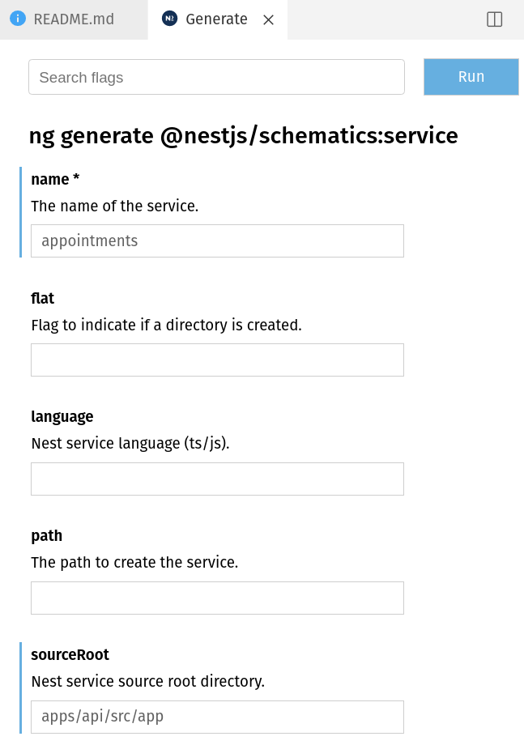

# Rapid Prototyping NestJS und Angular

## Was ist Rapid Prototyping?

Kommt ursprünglich aus der produzierenden Industrie. Bauteile schnell aus Modellen entwickeln. 
Idee soll schnell umgesetzt werden können zu einem funktionierenden, aber natürlich noch nicht ausgereiften Produkt. 
Der Prototyp soll nicht verworfen werden, sondern schrittweise ausgebaut und zu einer produktiv nutzbaren Anwendung reifen. 

## Technologie-Entscheidung

Wir möchten Code zwischen Backend, Frontend und Bibliotheken teilen können.
Eine gemeinsame Sprache in allen Teilprojekten zu verwenden bietet sich an.
Auch soll die Einstiegshürde für neue Team-Mitglieder möglichst niedrig sein.
Als Sprache bietet sich Typescript an, da es
a) Entwicklern die bisher nur Javascript Erfahrung haben erlaubt sich leicht einzuarbeiten.
b) Entwicklern die bisher OOP mit z.B.: Java entwickelt haben ein solides Typsystem bereitstellt.

Für das Frontend setzen wir auf Angular. Andere Frameworks wären genauso möglich.
Angular bietet ein sehr gutes Gesamtpaket.

Das Backend wird mit dem Framework NestJS entwickelt, das viele Konzepte analog
zu Angular implementiert.

## Das Tool Nx

### Was ist NX?

Nx ist eine Erweiterung und Aufsatz auf das Angular Command Line Interface.
Es stellt einen Workspace bereit und bietet Werkzeuge um zum Beispiel Code zu generieren,
das Build-System zu bedienen, oder aber auch Tests zu starten.

Zusätzlich bietet Nx Werkzeuge, um Abhängigkeiten innerhalb des Projekts zu steuern
und eine Möglichkeit die Verwendungen von mittels Constraints einzuschränken.

### Was ist ein Monorepo?

Anstatt jedes Projekt in ein eigenes Repository zu legen, werden mehrere Teilprojekte in
demselben Repository abgelegt. Dieses Vorgehen hat mehrere 

#### Vorteile:

- Einfachere Wiederverwendung von Quellcode, da keine Versionen als Artefakt veröffentlicht werden müssen.
- Bessere Verwaltung von Abhängigkeiten auf Fremd-Bibliotheken da diese für alle Teilprojekte gleich sind
- Atomare Commits, bei denen Änderungen über alle Teilprojekte hinweg durchgeführt werden
- Teamübergreifende Zusammenarbeit über Projektgrenzen hinweg

#### Nachteile:

- Sichtbarkeit kann nicht pro Teilprojekt gesteuert werden. Zugriff aufs Repository bedeutet Lese- bzw. Schreibrechte 
  auf dem gesamten Quellcode.
- Nicht alle Build-Systeme unterstützen Monorepos und werden langsamer als separat gebaute Projekte.

### Monorepo mit NX

Für das Prototyping existieren mindestens zwei Projekte, das Backend und das Frontend. Zusätzlich
möchten wir Code für beide Teilprojekte wiederverwenden können. Mit einem NX Workspace können wir
genau das tun.

## Umgebung mit NX einrichten

```bash
npx create-nx-workspace@latest
```

Vergebe den Workspace Namen `w11k` und den Application Namen `workshop-prototype`. Wähle das Preset
`Angular-Nest` aus und die Style Extension Sass.

Sobald die Generierung abgeschlossen ist, verschiebe den Inhalt des Verzeichnisses `w11k` in die Project-Root.

Ergänze die `package.json` den Eintrag `scripts` um ein Script zum Starten des Backends.

```json
{
  "scripts": {
    "start:api": "ng serve api"
  }
}
```

## Bibliothek für geteilten Code zwischen Backend und Frontend einrichten

Um Code zwischen Backend und Frontend teilen zu können, schreiben wir geteilten Code
in ein oder mehrere Bibliothek-Projekte. Zu diesem Zweck bietet sich die Verwendung
des `@nrwl/workspace` Schematic an.

```bash
ng g @nrwl/workspace:lib shared
```

## Abgrenzungen von Abhängigkeiten

Um zu vermeiden, das jedes Teilprojekt beliebig Code aus anderen Teilen importieren kann,
können wir Constraints setzen. Jedes Projekt kann in der `nx.json` Datei Tags besitzen. In 
der `ts-lint.json` können diese genutzt werden, um den Import auf bestimmte Tags zu beschränken.

Füge in der nx.json zu jedem Teilprojekt ein Tag ein. Für das Frontend verwende den Tag
`scope:frontend`, für das API Projekt `scope:backend` und für die beiden Bibliotheken `scope:lib`.

Erweitere in der `ts-lint.json` die Einschränkung der Imports so, dass Projekte mit dem Tag `scope:lib`
nur aus Projekten mit dem Tag `scope:lib` importieren dürfen. Frontend-Projekte dürfen aus
anderen Frontend-Projekten importieren und aus Bibliotheken. Analog dazu dürfen Backend Projekte andere
Backend Projekte und Bibliotheken verwenden.

### Backend Prototyping

Wir beginnen damit das Backend um eine Route für Reparatur-Termine zu erweitern. Die Struktur beschreiben
wir als Typescript Interface im Bibliothek-Projekt und Mock-Daten in Form einfacher Typescript Dateien 
im Server. 

```typescript
/** libs/api-interfaces/src/lib/api-interfaces.ts */
export interface Appointment {
  id?: number;
  assignment: string;
  branch: string;
  vehicleOwner: string;
  vehicleRegNo: string;
  status: string;
  date: string;
  time: string;
}
```

Wir erzeugen wir in unserem API Projekt einen Service und einen Controller mit jeweils dem Namen Appointments.
Dies kann über die Kommandozeile oder aber über die Visual Studio Code Extension `Nx Console` erfolgen. 
*Achtung* bei den Schematics zu NestJS muss der Pfad in dem generiert werden soll explizit mit angegeben werden.



Die Nutzung der `Nx Console` erzeugt im Terminalfenster von Visual Studio Code den zur
Generierung genutzten Befehl. Im folgenden werden nur noch die Kommandozeilen-Befehle
aufgeführt.

```bash
ng generate @nestjs/schematics:service --name=appointments --sourceRoot=apps/api/src/app --no-interactive
ng generate @nestjs/schematics:controller --name=appointments --sourceRoot=apps/api/src/app --no-interactive
```

Die Termine beziehen wir aus einer Mock-Datei die parallel zum Service liegt.   

```typescript
/** apps/api/src/app/appointments/appointments.mock.ts */
export const APPOINTMENTS: Appointment[] = [
  {
    id: 1,
    assignment: '000-000-01',
    branch: 'Dortmund',
    status: 'Reperatur',
    date: '2020-09-02',
    time: "07:00",
    vehicleOwner: "Sascha",
    vehicleRegNo: "ES-WW-01"
  },
  {
    id: 2,
    assignment: '000-000-02',
    branch: 'Berlin',
    status: 'Abholung',
    date: '2020-09-03',
    time: "08:00",
    vehicleOwner: "Tobi",
    vehicleRegNo: "B-WW-33"
  }
];
```

Die Termine werden im Service synchron zur Verfügung gestellt. Dieser kann dann per 
Dependency Injection im Controller konsumiert werden.

```typescript
/** apps/api/src/app/appointments/appointments.service.ts */
@Injectable()
export class AppointmentsService {
  private appointments: Appointment[] = APPOINTMENTS;

  getAll(): Appointment[] {
    return this.appointments;
  }
}

/** apps/api/src/app/appointments/appointments.controller.ts */
@Controller('appointments')
export class AppointmentsController {

  constructor(private readonly appointmentService: AppointmentsService) {  }

  @Get()
  getAllApointments(): Appointment[] {
    return this.appointmentService.getAll();
  }
}
```

Nachdem mit `npm run start:api` das Backend gestartet wurde, kann im Browser mit der URL
`localhost:3333/api/appointments` getestet werden, ob sich die Termine abrufen lassen.


### Termine im Frontend anzeigen

Für die nächste Stufe möchten wir die Termine im Browser anzeigen. Dazu werden diese per Http-Client
vom Server abgerufen. Der Abruf wird nicht von der anzuzeigenden Komponente selbst durchgeführt,
sondern in einem Service gekapselt. Die Termine werden in Form einer Liste ausgegeben.

```bash
ng generate @schematics/angular:module --name=appointments --routing --no-interactive
ng generate @schematics/angular:service --name=appointments/appointments --no-interactive
ng generate @schematics/angular:component --name=appointments/appointmentListRoute --no-interactive
ng generate @schematics/angular:component --name=appointments/appointmentList --no-interactive
```

In der Komponente `AppointmentListRouteComponent` werden die Termine per Service geladen und
in `AppointmentListComponent` per Input hereingereicht und angezeigt.


### Termine im Frontend bearbeiten

Der nächste Schritt ist eine Detailansicht zu den einzelnen Terminen mit den allen Informationen.
In dieser sollen auch ein Formular zur Bearbeitung enthalten sein. Wir erweitern die Termine um eine
numerische ID um das Routing abbilden zu können. Das Speichern soll einen HTTP-Request auslösen. 

Es wird eine neue Route für die Detailansicht angelegt und die Komponenten generiert.

```bash
ng generate @schematics/angular:component --name=appointments/appointmentDetailRoute --no-interactive
ng generate @schematics/angular:component --name=appointments/appointmentDetail --no-interactive
``` 

Die `AppointmentDetailRouteComponent` liest die Id des Termins aus den Routen-Parametern aus und
verwendet den Service um die `AppointmentDetailsComponent` anzuzeigen. Das Button zum Speichern
soll im Moment nur eine Ausgabe in der Konsole machen.


```html
<!-- apps/workshop-prototype/src/app/appointments/appointment-detail/appointment-detail.component.html -->
<form [formGroup]="form" (ngSubmit)="save()">
  <div>
    <label>Owner</label>&nbsp;<input type="text" [formControl]="formModel.vehicleOwner">&nbsp;
    <span class="error" *ngIf="formModel.vehicleOwner.invalid">Please provide an owner</span>
  </div>
  <div>
    <label>Date</label>&nbsp;<input type="date" [formControl]="formModel.date">&nbsp;
    <span class="error" *ngIf="formModel.date.invalid">Please provide a valid date</span>
  </div>
  <div>
    <label>Time</label>&nbsp;<input type="time" [formControl]="formModel.time">&nbsp;
    <span class="error" *ngIf="formModel.time.invalid">Please provide a valid time</span>
  </div>
  <div>
    <label>Registration No</label>&nbsp;<input type="text" [formControl]="formModel.vehicleRegNo">&nbsp;
    <span class="error" *ngIf="formModel.vehicleRegNo.invalid">Please provide a registration number</span>
  </div>
  <div>
    <label>Branch</label>&nbsp;
    <select [formControl]="formModel.branch">
      <option value="Dortmund">Dortmund</option>
      <option value="Berlin">Berlin</option>
    </select>&nbsp;
    <span class="error" *ngIf="formModel.branch.invalid">Please select a branch</span>
  </div>
  <div>
    <label>Status</label>&nbsp;
    <select [formControl]="formModel.status">
      <option value="Reperatur">repair</option>
      <option value="Abholung">ready for pickup</option>
    </select>
  </div>
  <div><button type="submit" [disabled]="form.invalid">save</button></div>
</form>
```

### Speichern der Termine im Server

Wir erweitern den Controller der Termine um eine Methode zum Bearbeiten. Diese annotieren wir mit
Patch. Der Service wird um eine Methode zum Aktualisieren eines Termins erweitert.

```typescript
/** apps/api/src/app/appointments/appointments.service.ts */
export class AppointmentsService {
  updateAppointment(id: number, appointment: Partial<Appointment>) {
    const canidate: Appointment | undefined = this.appointments.find(a => a.id === id)
    if (canidate === undefined) {
      throw new Error(`no appointment with id ${id} found.`);
    }
    const patchedAppointment: Appointment = { ...canidate, ...appointment };
    this.appointments = this.appointments.map(a => a.id === id ? patchedAppointment : a);
    return patchedAppointment;
  }
}

/** apps/api/src/app/appointments/appointments.controller.ts */
@Controller('appointments')
export class AppointmentsController {
  @Patch(':id')
  saveAppointment(@Param('id') id: string, @Body() appointment: Partial<Appointment>): Appointment {
    console.log("id %o, appointment %o", id, appointment);
    return this.appointmentService.updateAppointment(parseInt(id, 10), appointment);
  }
}
```

Im Frontend wird das Formular an die neue Backend Route zum Speichern angepasst. Der `AppointmentsService`
im Client wird ebenso erweitert.

```typescript
/** apps/workshop-prototype/src/app/appointments/appointments.service.ts */
export class AppointmentsService {
  saveAppointment(id: number, appointment: Partial<Appointment>): Observable<Appointment> {
    return this.http.patch<Appointment>('api/appointments/' + id, appointment)
      .pipe(
        tap(result => this.subject.next(this.subject.value.map(a => a.id === id ? result : a))),
        switchMap(() => this.getById(id).pipe(take(1)))
      );
  }
}
```


### Öffnungszeiten für die einzelnen Reparatur-Standorte

Nicht jeder unserer Standorte hat zu genau den gleichen Zeiten geöffnet. Wir erweitern unser Datenmodell
um Öffnungszeiten. Das Abschicken des Formulars soll nur möglich sein, wenn die Filiale auch in der
Zeit geöffnet hat.

Um Entscheidungen zu den Öffnungszeiten fällen zu können, legen wir diese für die einzelnen Standorte 
fest. Zur Überprüfung im Formular verwenden wir einen asynchronen Validator an der Gruppe. 

```bash
ng generate @schematics/angular:service --name=appointments/OpeningHoursValidator --project=workshop-prototype --no-interactive
```

```typescript
/** apps/workshop-prototype/src/app/appointments/opening-hours-validator.service.ts */
export const timeRegExp = /^(0[0-9]|1[0-9]|2[0-3]):[0-5][0-9]$/;

@Injectable({
  providedIn: 'root',
})
export class OpeningHoursValidatorService {
  constructor(private readonly appointmentsService: AppointmentsService) {}

  openingHoursValidator(timeControlName: string, branchIdControlName: string): AsyncValidatorFn {
    return (group: FormGroup) => {
      const time = group.get(timeControlName)?.value;
      const branchId = group.get(branchIdControlName)?.value;
      return this.appointmentsService.getOpeningHoursPerBranch().pipe(
        first(),
        map((perBranch) => perBranch[branchId]),
        map((openingHoursOfBranch) => {
          if (time == null || openingHoursOfBranch == null) {
            return { openingHours: 'Could not find time or opening hours' };
          }

          return isTimeInInterval(time, openingHoursOfBranch.openingHoursStart, openingHoursOfBranch.openingHoursEnd)
            ? null
            : {openingHours: `time ${time} is not in interval [${openingHoursOfBranch.openingHoursStart}, ${openingHoursOfBranch.openingHoursEnd}]`, };
        })
      );
    };
  }
}

function isTimeInInterval(time: string, start: string, end: string): boolean {
  const allInCorrectFormat =
    timeRegExp.test(time) && timeRegExp.test(start) && timeRegExp.test(end);
  if (allInCorrectFormat === false) {
    return false;
  }

  return allInCorrectFormat && time >= start && time <= end;
}
```

### Öffnungszeiten im Frontend und Backend prüfen

Nur das Absenden des Formulars zu blockieren ist nicht genug. Auch in unserem Server möchten wir
verhindern, dass Termine angelegt werden, bei denen die Filiale nicht geöffnet ist. Die notwendige
Prüfung verschieben wir aus dem Frontend in das Bibliothek-Projekt und verwenden den gleichen Code
sowohl im Browser als auch in unserem Nest-Server.

Die Funktion `isTimeInInterval` wandert in `libs/shared/src/lib/shared.ts`.
Bisher wurden die Standorte im Client verwaltet. Für das Abrufen der Öffnungszeiten erzeugen wir
einen neuen Controller.

```bash
ng generate @nestjs/schematics:controller --name=branches --sourceRoot=apps/api/src/app --no-interactive
```

Die Interfaces werden in `libs/api-interfaces/src/lib/api-interfaces.ts` verschoben.

Schlägt das Speichern des Termins fehl, weil dieser außerhalb der Öffnungszeiten stattfinden soll,
wird ein Fehler mit dem Status Code Bad Request zum Frontend gesandt.

```typescript
/** apps/api/src/app/appointments/appointments.service.ts */
export class AppointmentsService {
  updateAppointment(id: number, appointment: Partial<Appointment>): Appointment {
      const canidate: Appointment | undefined = this.appointments.find(
        (a) => a.id === id
      );
      if (canidate === undefined) {
        throw new Error(`no appointment with id ${id} found.`);
      }
      const patchedAppointment: Appointment = { ...canidate, ...appointment };
      const start = openingHoursPerBranch[patchedAppointment.branch].openingHoursStart;
      const end = openingHoursPerBranch[patchedAppointment.branch].openingHoursEnd;
      if (
        false === isTimeInInterval(patchedAppointment.time, start, end)
      ) {
        throw new Error(`The time ${patchedAppointment.time} of the appointment is not within the opening hours (${start} - ${end})`);
      }
  
      this.appointments = this.appointments.map((a) =>
        a.id === id ? patchedAppointment : a
      );
      return patchedAppointment;
    }
}
```

# Testen

Bisher haben wir noch keine Tests geschrieben. In den frühen Phasen des Prototyps wäre es wahrscheinlich eher hinderlich.
Sobald ein gewisser Reifegrad erreicht worden ist, werden Tests zunehmend wichtiger.
